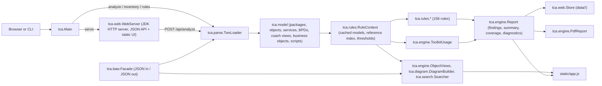

# TWX Code Analyzer

TWX Code Analyzer is a local tool for the static analysis of IBM Business Process Manager / Business Automation Workflow (BAW, CP4BA) process applications exported as `.twx` packages. It reads the export directly (no BPM database, no server connection), runs 156 rules over services, processes, coach views, business objects, scripts, toolkits and configuration, and presents ranked findings with the full artifact path, the offending code line, remediation guidance and diagrams that show where each finding sits.

It also answers the everyday questions about an export: which toolkit artifacts does the application really use, what changed between two snapshots, where is a variable or a service referenced, and what does a business object look like once its nested types are resolved.

Everything runs on your machine. Nothing is uploaded anywhere.

License: MIT (attribution required, see [License](#license)).

## What it offers

* Parse `.twx` process applications with their bundled toolkits (recursively).
* 156 static-analysis rules in 15 categories: application structure, dependencies, services, processes (BPDs), scripts (pattern and syntax-tree based), coach views, business objects, data, naming, documentation, performance, security, configuration, migration, quality.
* Findings ranked by a weighted score, each with the artifact path (application > type > artifact > step or script), line and column, the source line, the reason it matters and how to fix it; "needs review" findings are marked separately from confirmed ones.
* Health score per snapshot and analysis history; comparison of two snapshots of the same application (added, removed, changed artifacts; new and fixed findings).
* Service and process diagrams rendered from the coordinates stored in the export, with the flagged steps highlighted and a "show in diagram" jump from every finding.
* Toolkit Usage report with evidence tiers (used, possible usage, no detected usage), duplicate snapshots merged, toolkit-to-toolkit references, exportable as HTML or PDF.
* Artifact browser: variables, steps or flow objects with lanes and assignments, scripts, coach view options and resources, business object schema with nested types (circular and unresolved types flagged), managed asset content, references both ways, raw XML.
* TWX search: text or regular expression over names, scripts, conditions, mappings, documentation and raw XML, with artifact type and toolkit filters.
* Exports: CSV, self-contained HTML and PDF reports of the findings (respecting the current filter) and of the toolkit usage.
* Settings: analyze bundled toolkits by default, and the numeric thresholds behind the size and complexity rules.
* Analysis coverage and diagnostics: product version of the export, scripts skipped because of syntax errors, missing object files, unreadable toolkits.
* A command line for batch use (JSON output) and a JSON facade to embed the engine in other Java or BAW deliveries.

The browser UI has the pages Analyze, History, Compare, Rules and Settings, and per report the tabs Findings, Overview, Objects & Diagrams, Toolkit Usage and TWX Search.

## Quick start

Requirements: Java 8 or newer to run (the packaged builds ship their own runtime), JDK 17 or newer to build.

```
# build
JAVA_HOME=/path/to/jdk17 ./build.sh          # -> build/twx-code-analyzer.jar

# local web app (listens on 127.0.0.1 only, opens the browser)
java -jar build/twx-code-analyzer.jar serve 8765 data

# command line
java -jar build/twx-code-analyzer.jar analyze MyApp.twx report.json   # findings, summary, toolkit usage, coverage as JSON
java -jar build/twx-code-analyzer.jar inventory MyApp.twx             # what the loader sees
java -jar build/twx-code-analyzer.jar rules docs/RULES.md             # rule catalogue as markdown
```

`run.sh` / `run.bat` start the packaged app; `package.sh` builds the Linux and Windows distributions with a trimmed Java runtime (see [docs/BUILD-AND-SIGNING.md](docs/BUILD-AND-SIGNING.md)).

## How a TWX is read

A `.twx` file is a ZIP archive with an IBM-defined structure:

```text
application.twx
├── META-INF/
│   ├── package.xml         manifest: project, branch, snapshot, buildVersion, dependencies, object list
│   └── metadata.xml
├── objects/
│   └── <objectId>.xml      one XML document per artifact
├── toolkits/
│   └── <snapshot>.zip      every bundled toolkit, same layout (recursively)
└── files/
    └── <assetId>/<name>    content of the managed assets (server files, web files, images ...)
```

Loading happens in four stages (`tca.parse.TwxLoader`):

1. `META-INF/package.xml` provides the package identity (name, acronym, snapshot, branch, the product version that produced the export) and the dependency list (toolkit snapshots, system or not).
2. Every `<object>` entry of the manifest (id, versionId, name, type) is joined with its `objects/<id>.xml` document. Missing documents are recorded as diagnostics instead of failing the load.
3. `toolkits/*.zip` are loaded the same way and attached to the model by snapshot id; embedded subprocess BPDs (exported with their GUID as name) are relabelled after the activity that embeds them.
4. `files/` members are listed; JavaScript managed assets are kept in memory so the script rules know the functions defined by server files and web files.

The object type comes from the manifest. The numeric prefix of an object id identifies the artifact family:

| Prefix | Type in the manifest | Shown as |
|---|---|---|
| 1 | `process` | Service, grouped by its kind (see below) |
| 25 | `bpd` | Process (BPD) |
| 64 | `coachView` | Coach View |
| 12 | `twClass` | Business Object |
| 61 | `managedAsset` | Managed Asset (server file, web file, design file) |
| 21 | `epv` | Exposed Process Value |
| 24 | `participant` | Team |
| 4 | `underCoverAgent` | Undercover Agent |
| 7 | `webService` | Web Service |
| 14 | `trackingGroup` | Tracking Group |
| 62 | `environmentVariableSet` | Environment Variables |
| 51 | `userAttributeDefinition` | User Attribute |
| 63 | `projectDefaults` | Project Defaults |
| 2064 | `SmartFolder` | Saved Search |

A service (`process`) is classified by its `processType` code: 1 decision service, 2 Ajax service, 3 heritage human service, 4 integration service, 6 general system service, 7 advanced integration service, 10 client-side human service (CSHS), 11 external service, 12 service flow, 13 deployment service flow. The Objects tab groups services by this kind, so client-side human services, Ajax services and integration services are separate groups.

Type-specific parsers (`ServiceParser`, `BpdParser`, `CoachViewParser`, `BusinessObjectParser`) turn the XML into models: steps with their component, coordinates, scripts, mappings and pre/post assignments; lanes, flow objects, flows and boundary events; coach view options, event handlers, inline scripts, AMD dependencies and included resources; business object properties with type references. `Scripts` collects every executable snippet of an artifact (step scripts, text templates, link conditions, mappings, default values, coach view handlers and inline scripts) with a human-readable location.

## How the analysis works

`tca.engine.Analyzer` runs every rule of `tca.rules.RuleSet` over a `RuleContext` that lazily parses and caches the models, keeps a reverse reference index (which artifact references which), and exposes the thresholds from the settings.

Rules produce findings. Each finding carries:

| Field | Meaning |
|---|---|
| `ruleId`, `title`, `category`, `severity` | The rule (see [docs/RULES.md](docs/RULES.md)) |
| `score` | Severity weight (Critical 100, Major 40, Minor 10, Info 2) x rule impact (1..3); the ranking key |
| `confidence` | `high` = certain from the export; `medium` = heuristic match, shown as "needs review" |
| `path` | Application (acronym) / artifact type / artifact / step or script |
| `line`, `column`, `snippet` | Position and source line inside the script or template when known |
| `message`, `evidence`, `remediation`, `reference` | What was found, the proof, what to do, the source of the rule |

Three kinds of rules exist:

* **Structural rules** read the models: unconnected steps, gateways without a default path, services without error handling, coaches after long chains of steps, teams with static member lists, toolkit cycles, unused artifacts, missing references, business objects with too many properties, naming and documentation conventions, size thresholds.
* **Pattern rules** run over comment- and string-stripped script text: string-built SQL, hard-coded credentials and URLs, debug output, `toString()` of business objects in mappings, synchronous browser calls, ES6 syntax in server scripts, and the JavaScript syntax check itself.
* **Syntax-tree rules** parse each script with the Rhino parser (bundled, no runtime dependency) into an abstract syntax tree and reason on it: undefined identifiers with scope resolution (server-side scripts know the BAW API objects, the functions of the application's and toolkits' server files; coach view scripts know the browser and coach globals, AMD dependency arguments, the view's own scripts and the web assets the view includes); undeclared `tw.local` variables checked against the parameters and private variables of the service or process (embedded subprocesses inherit the parent's variables); definite division by zero and null or undefined property access by straight-line constant tracking; `eval` on process data; loops without an exit; active `debugger`; `parseInt` without radix; hard-coded business constants; dynamic SQL construction. IBM template syntax (`<#= tw.env.NAME #>`) is handled as template content, not as a JavaScript error.

Scripts with syntax errors are reported once (rule TCA-JS-021) and skipped by the syntax-tree rules; the report's coverage block lists them and marks the analysis as partial.

Findings are ranked by score, then severity, then artifact. The health score is `100 x exp(-density / 40)` where density is the total score per application artifact: 100 is clean, a typical legacy application scores between 10 and 30.

> Static analysis is advisory. Confirm a finding in the application context before changing production logic.

### Rule sources

The rules come from three places, documented in `docs/`:

* the rule table of a legacy, database-backed code analyzer that ran on Process Center (176 rules, 129 of them re-implemented statically; the mapping is in [docs/LEGACY-RULES.md](docs/LEGACY-RULES.md)),
* IBM's published checkstyle rules for BAW and CP4BA best practices ([docs/RESEARCH-RULE-SOURCES.md](docs/RESEARCH-RULE-SOURCES.md)),
* JavaScript static analysis (scope analysis, constant propagation, dangerous constructs).

The complete catalogue with description and remediation for every rule is generated from the code: [docs/RULES.md](docs/RULES.md).

## Toolkit Usage

The Toolkit Usage tab answers where the application uses each bundled toolkit. Duplicate snapshots of the same toolkit (a common situation after upgrades) are shown as one logical toolkit. Every toolkit is listed, including those with no detected usage.

| Status | Evidence |
|---|---|
| **Used** | An application artifact references the toolkit artifact's id in its XML: a service call, a coach view in a layout, a business object as a variable type, an included asset, a team, an EPV. Certain. |
| **Possible usage** | An application script instantiates a business object with `new tw.object.Name()` and exactly one toolkit declares that name (the application itself none). Inferred. |
| **No detected usage** | Neither. This is not proof that the toolkit can be removed: lookups by name at runtime (`tw.system.model.findProcessByName`, service names in configuration) are invisible to static analysis. |

Ambiguous constructor names (several toolkits declare the same business object) are reported as diagnostics, not counted as usage. References from other toolkits are listed per toolkit, because a toolkit that only another toolkit needs is still required.

Expand a toolkit to see its used artifacts grouped by type and the application artifacts that use each of them (clickable). Select toolkits and export the report as self-contained HTML (print to PDF from the browser) or as a PDF rendered by the engine.

## Objects & Diagrams

The artifact tree groups the application (and, optionally, every bundled toolkit) by artifact kind and shows the number of findings per artifact. Selecting an artifact shows:

* the diagram of a service or process drawn from the Process Designer coordinates (steps with findings outlined in red, click a step for its scripts, mappings and findings),
* its findings,
* variables (parameters and private variables with type, default and documentation),
* steps or flow objects as a flat list (kind, implementation with a link to the called artifact, lane, pre/post assignments, mapping count, script size, error handling),
* scripts with their location,
* coach view configuration options, binding and included resources,
* business object properties with the nested structure of complex types resolved in place (circular references and types missing from the export are flagged),
* managed asset type, size and content for JavaScript files,
* references and referenced-by lists (both clickable),
* the raw XML on request.

## Exports

| Export | Where | Content |
|---|---|---|
| CSV | Findings tab | The filtered findings with path, message, evidence and remediation |
| HTML | Findings tab, Toolkit Usage tab | Self-contained page (summary, rules, findings or toolkit usage), print to PDF from the browser |
| PDF | Findings tab, Toolkit Usage tab | Rendered by the engine (`tca.engine.Pdf`, no external library), A4 landscape, page breaks with repeated table headers; the findings PDF respects the current filter and sort |
| JSON | `analyze` command, `/api/report/<id>` | The full report (inventory, summary, coverage, diagnostics, toolkit usage, rules, findings) |

## History and comparison

Every analysis is stored under `data/<id>/` as the uploaded file, the report JSON and a small metadata file (no database). The History page lists them; Compare takes two analyses of the same application and reports added, removed and changed artifacts, toolkit version changes, and the findings that are new (regressions) or fixed.

## Settings

Stored in the browser (localStorage): whether bundled toolkits are analyzed by default, and the numeric thresholds used by the size and complexity rules (script length, steps per service, parameters, private variables, flow objects, nested coach views, controls per coach, toolkit count and depth, asset sizes ...). Threshold values are sent with each analysis; the defaults are stated in every rule text.

## Architecture



Java 8 bytecode, no framework, one dependency (Mozilla Rhino, shaded into the jar for the JavaScript parser). The web UI is plain HTML and JavaScript with Bootstrap, Font Awesome and Chart.js served from the jar's `static/` folder. See [docs/ARCHITECTURE.md](docs/ARCHITECTURE.md) for the package layout, the TWX facts the parsers rely on, and the ranking formulas; [docs/EMBEDDING.md](docs/EMBEDDING.md) for the JSON facade used to embed the engine in other deliveries.

## HTTP API (local web app)

| Endpoint | Purpose |
|---|---|
| `POST /api/analyze?toolkits=0|1&name=<file>&settings=<json>` | Analyze an uploaded TWX (multipart or raw body); returns the report |
| `GET /api/report/<id>` · `DELETE /api/report/<id>` | Stored report / delete an analysis |
| `GET /api/report/<id>/pdf?sev=&cat=&rule=&type=&conf=&q=&sort=` | Findings PDF with the same filter as the UI |
| `GET /api/history` | Analyses list |
| `GET /api/objects/<id>?toolkits=1` · `GET /api/object/<id>/<objectId>?xml=1` · `GET /api/diagram/<id>/<objectId>` | Artifact tree, artifact detail, diagram geometry |
| `GET /api/toolkit-usage/<id>` · `GET /api/toolkit-usage/<id>/pdf?keys=k1|k2` | Toolkit usage (also part of the report) and its PDF |
| `GET /api/search/<id>?q=&regex=&case=&scope=&types=&toolkits=` | TWX search |
| `GET /api/compare?a=<id>&b=<id>` | Snapshot comparison |
| `GET /api/rules` | Rule catalogue |

## Privacy and security

The tool parses files locally and listens on 127.0.0.1 only. It makes no network calls of its own; the only outbound connection is the optional Process Center export of the embedding facade, which happens only when a caller supplies a server URL and credentials. No telemetry, no external scripts or fonts in the UI.

## Documentation

* [docs/RULES.md](docs/RULES.md) - the 156 rules with description and remediation (generated)
* [docs/LEGACY-RULES.md](docs/LEGACY-RULES.md) - mapping of the legacy analyzer's 176 rules to the static rules
* [docs/RESEARCH-RULE-SOURCES.md](docs/RESEARCH-RULE-SOURCES.md) - public sources of the best-practice rules
* [docs/ARCHITECTURE.md](docs/ARCHITECTURE.md) - packages, TWX facts, ranking, diagrams, deliveries
* [docs/EMBEDDING.md](docs/EMBEDDING.md) - the JSON facade for embedding the engine (Java, BAW)
* [docs/BUILD-AND-SIGNING.md](docs/BUILD-AND-SIGNING.md) - reproducible build, packaging, signed Windows launcher

## License

MIT License. You may use, copy, modify and redistribute the software, including commercially, provided the copyright notice and the license text are kept in all copies or substantial portions (attribution). See [LICENSE](LICENSE).

Third-party components: Mozilla Rhino (MPL 2.0), Bootstrap (MIT), Font Awesome Free (CC BY 4.0 / SIL OFL 1.1 / MIT), Chart.js (MIT).
