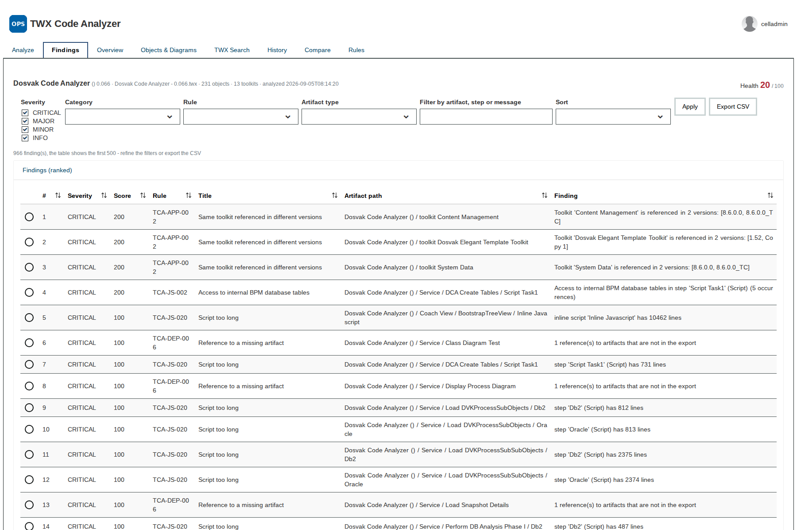
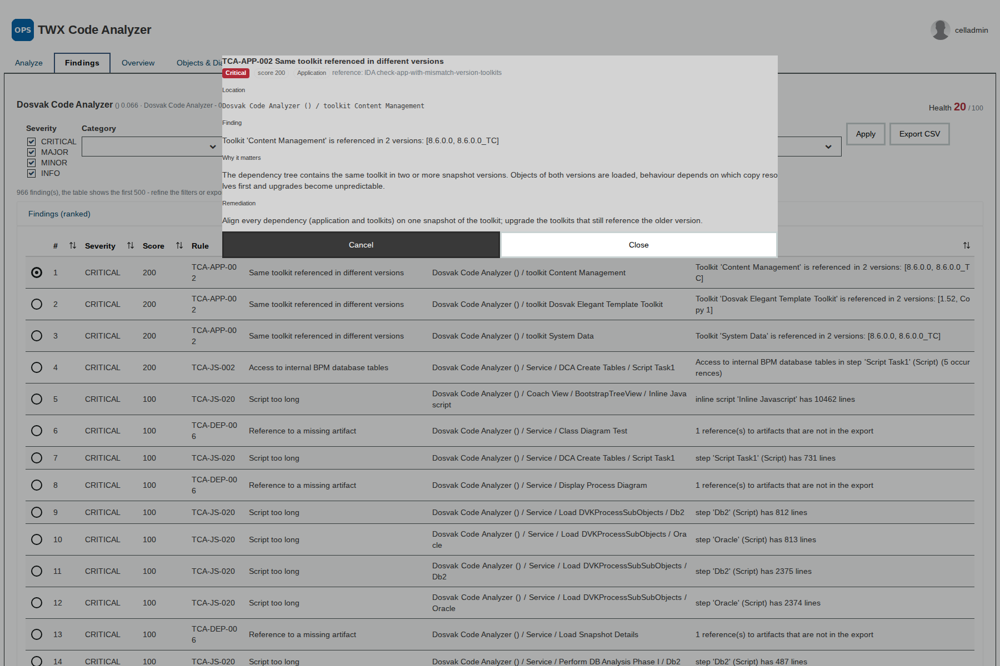
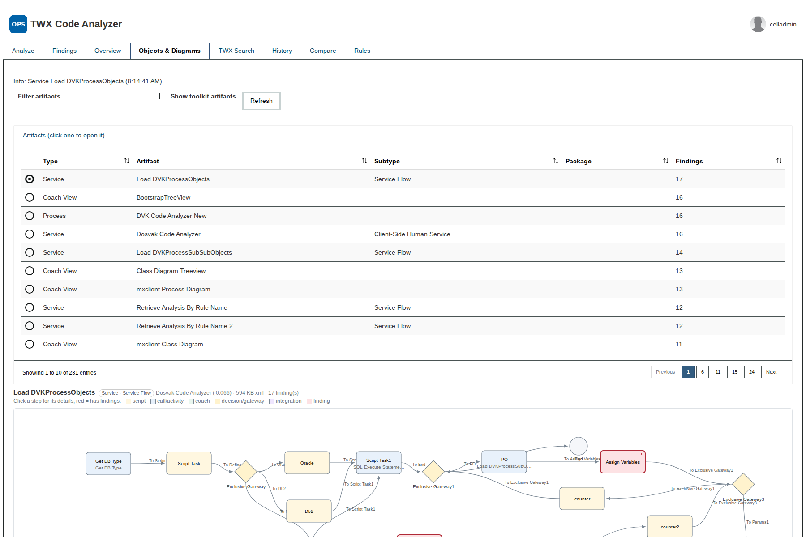
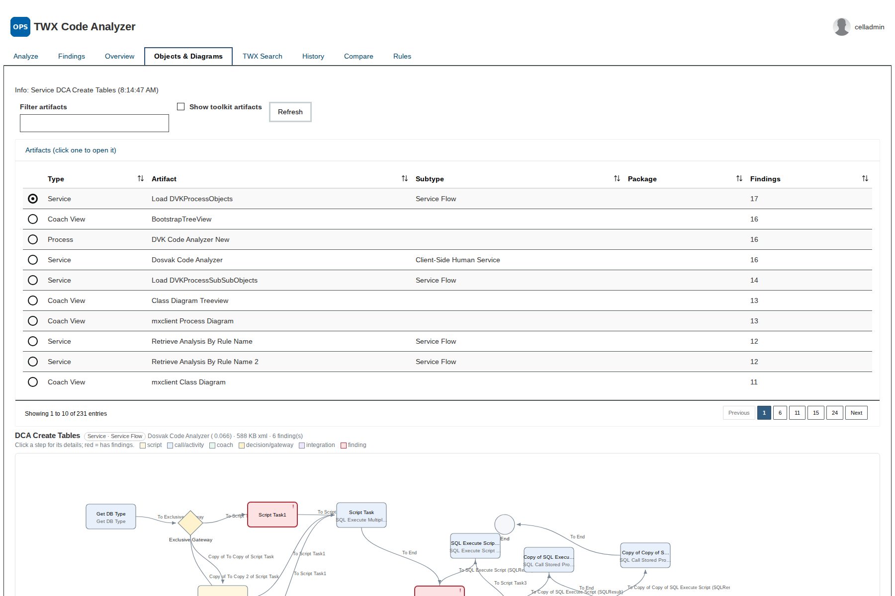
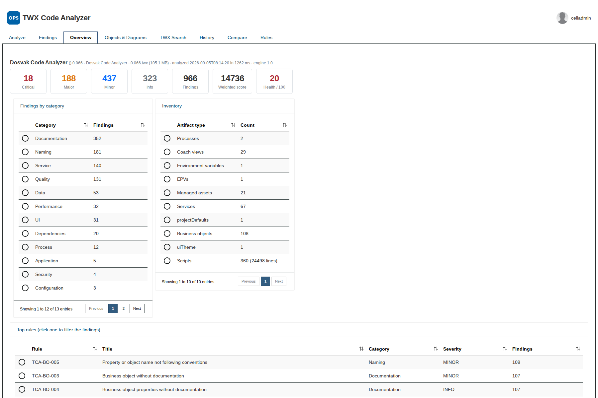
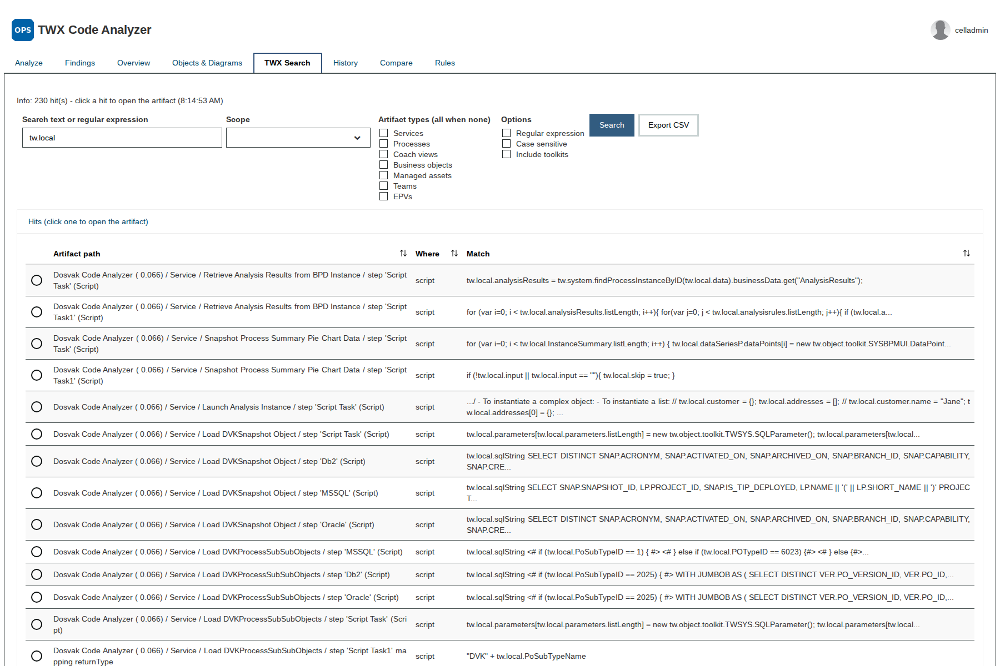
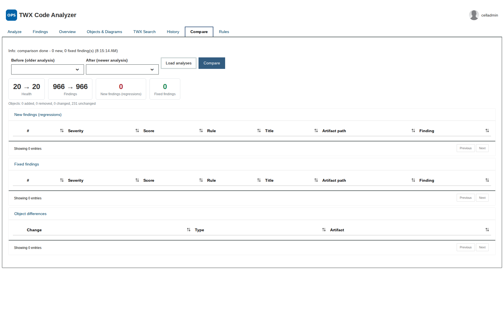
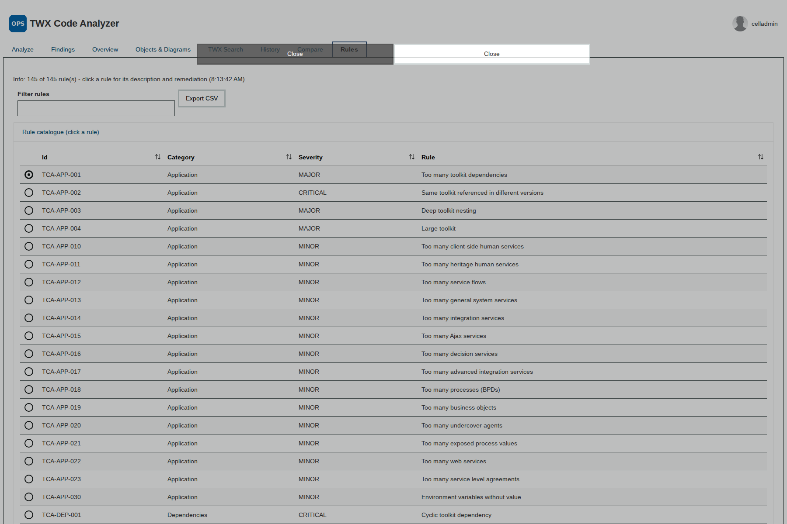

# TWX Code Analyzer as a BAW process application

The analyzer engine delivered **inside** IBM Business Automation Workflow: a process application (`TWX Code Analyzer`, acronym
`TWXCA`) with the same functions as the desktop and web editions - ranked findings, overview, object explorer with service and process
diagrams, TWX search, history, snapshot comparison, rule catalogue - built from out-of-the-box building blocks only (System Data,
UI Toolkit, client-side human service, service flows, one legacy-format integration service for the Java call).

| File | Target | Notes |
|---|---|---|
| [`TWX-Code-Analyzer-1.2.twx`](TWX-Code-Analyzer-1.2.twx) | traditional BAW / IBM BPM 8.6.x and later (Process Center or Workflow Server) | engine 1.3 embedded as a managed server file |
| [`cp4ba/TWX-Code-Analyzer-1.1-CP4BA_25.twx`](cp4ba/TWX-Code-Analyzer-1.1-CP4BA_25.twx) | CP4BA 25.0.x, **design-time only** | imports and opens in the web designer; one validation error remains because CP4BA does not run Java integration services and a managed jar is not visible to server-side JavaScript. A Cloud Pak delivery calls the [web edition's HTTP API](../docs/WEB-APPLICATION.md) instead |

## How it works

| Question | Answer |
|---|---|
| Where do the TWX files come from | a folder on the server (environment variable `twxFolder`, created if missing). The dashboard lists the folder and can export any snapshot of a Process Center into it (`processCenterURL` + the user's Process Center login, used once per export, never stored). No browser upload - exports are 30 - 110 MB |
| Where does the history live | one instance of the process **TWX Analysis** per analysis: it runs the engine (system task -> Analyzer Service), stores the summary as JSON and waits on a retention timer (365 days) so the variables stay readable through REST; delete = terminate and delete the instance |
| Where is the full report | written by the engine to `<twxFolder>/.tca/<reportKey>.json` and loaded by the views through the service; diagrams, object details, search and comparisons are computed from the TWX on demand (the engine keeps the last three parsed models in memory) |
| How do the views call the engine | through the Ajax-exposed service flow **Analyzer Service** (`op`, `args` in, `result` out): `ping, files, analyze, report, objects, object, search, compare, toolkitUsage, pdf, toolkitUsagePdf, rules, export, deleteFile`; the process calls the same service as a system task |

Objects: `twx-code-analyzer.jar` (managed server file, the engine, Java 8 bytecode with Rhino shaded; entry point
`tca.baw.Facade.call(op, argsJson, folder)`, JSON in / JSON out), `tca.js` (managed web file, shared client library of the views),
`Analyzer Java Service` (integration service with the Java step), `Analyzer Service` (service flow), `TWX Analysis` (process),
`TWX Code Analyzer` (dashboard: App Header + tab section with the tabs Analyze, Findings, Overview, Objects & Diagrams, Toolkit
Usage, TWX Search, History, Compare, Rules), row business objects (FileRow, AnalysisRow, FindingRow, RuleRow, ObjectRow, SearchHit,
DiffRow, ToolkitRow, ToolkitUsageRow, SnapshotRow).

## Install and configure

1. Process Center console > *Import Process App* > `TWX-Code-Analyzer-1.2.twx`.
2. Environment variables: `twxFolder` (server folder for the exports and reports, default `/tmp/twx-code-analyzer`),
   `processCenterURL` (Process Center to export snapshots from, `https://host:9443`), `restBaseURL` (`/rest/bpm/wle/v1`),
   `appTitle`, `logoURL`.
3. Expose the dashboard *TWX Code Analyzer* to the team of developers / architects and the process *TWX Analysis* to the same users
   (analyses are started as instances of that process). Put `.twx` exports into `twxFolder` or export them from the Analyze tab.

The engine runs in the BAW JVM: a 105 MB export analyses in about 40 seconds, a 40 MB export in about 15 seconds (event manager
throughput decides how quickly the queued analysis starts).

## Screenshots

| | |
|---|---|
|  Analyze tab after an analysis |  Findings with the detail modal |
|  Objects & Diagrams: service diagram |  "Show in diagram" from a finding |
|  Overview |  TWX Search |
|  Compare two snapshots |  Rule catalogue |

## Verification

* BAW 8.6.2 / 20.0.0.1: full browser walk-through (analysis of a 105 MB export, findings, detail modal, artifact list, service diagram
  with node click, show-in-diagram, search, history, compare, rules), large exports analysed by `TWX Analysis` instances, Process
  Center export from inside the server; design-time sweep [DESIGN-SWEEP-1.1-baw-8.6.2.md](DESIGN-SWEEP-1.1-baw-8.6.2.md).
* CP4BA 25.0.1: design-time only, see [DESIGN-SWEEP-1.1-cp4ba-25.0.1.md](DESIGN-SWEEP-1.1-cp4ba-25.0.1.md).

The package is generated from a declarative build in a private workspace of Dosvak LLC. License: Apache-2.0 like the engine
(see [../LICENSE](../LICENSE) and [../NOTICE](../NOTICE)).
